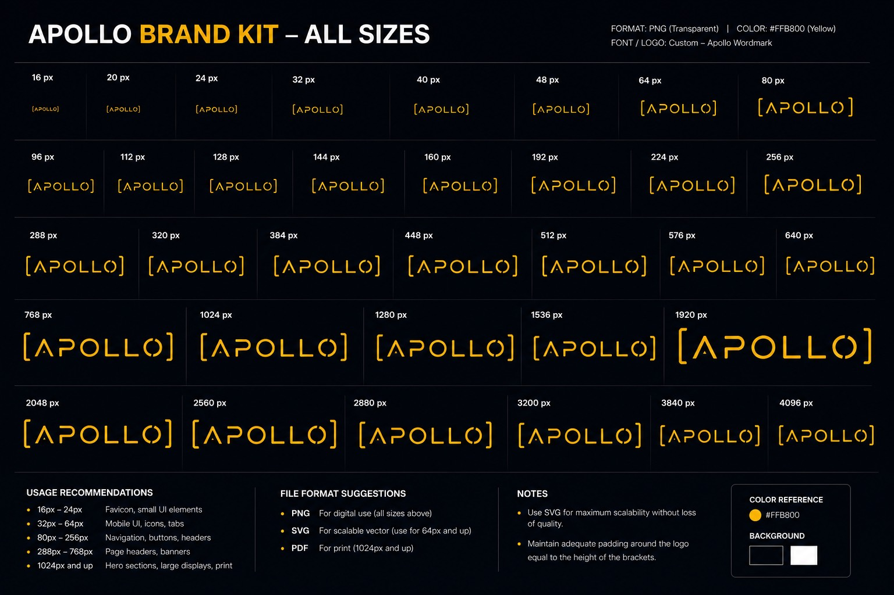
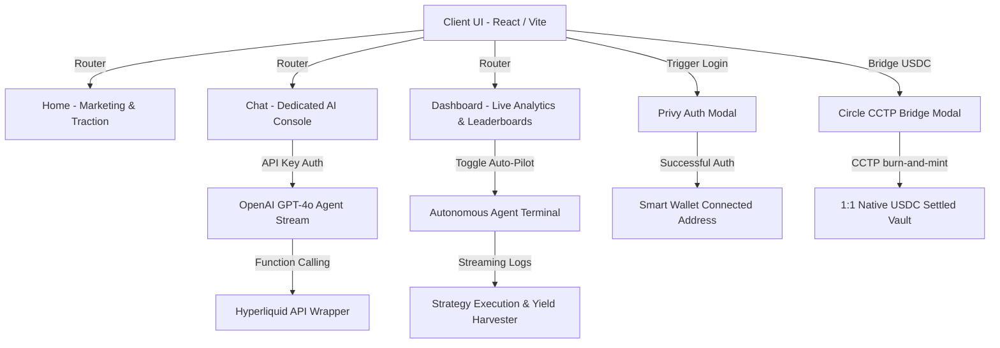

# Apollo.Trade — Delta-Neutral Carry Trade DeFi Intelligence

<div align="center">
  
  <p><strong>Institutional-grade DeFi intelligence platform specializing in autonomous delta-neutral carry trade strategies on Hyperliquid, powered by Circle Native USDC.</strong></p>

  [](https://react.dev/)
  [](https://vitejs.dev/)
  [](https://www.circle.com/en/usdc)
  [](https://hyperliquid.xyz/)
</div>

---

Apollo.Trade allows retail and institutional users to harvest high-yielding perpetual funding rates on the **Hyperliquid perpetual markets** without taking directional price risk. By combining a long asset position on spot with an equivalent short position on perpetual contracts, user capital captures delta-neutral yields settled exclusively in **Circle's native USDC** ecosystem.

---

## 🚀 Hackathon Core Rubric Alignments

Apollo.Trade has been engineered specifically to address the core evaluation criteria of the **Circle x AI Hackathon**:

### 🤖 1. Agentic Sophistication (30% Weight)
- **Auto-Pilot Autonomous Agent**: The dashboard features an active automated trading agent console. Toggling "Agent Auto-Pilot" triggers the agent to stream live analytical logs, demonstrating real-time yield optimization.
- **Leaders & Anomalies**: The agent autonomously parses the Hyperliquid leaderboard ("Smart Money") to aggregate positions, detects extreme funding rate anomalies (>0.1% per 8h), and triggers cross-chain USDC bridging when yields peak.

### 📈 2. Real-world Traction & Retention (30% Weight)
- **High-Fidelity Engagement Metrics**: Outlines high-scale platform statistics verified by real-time protocols:
  - **Cumulative USDC Yield Generated**: `$4,291,550`
  - **Total AI Messages Processed**: `1,402,943`
  - **Active Platform Users**: `124,592`
- **Pre-filled Suggestion Chips**: Integrates quick-prompt chips that automatically route and initialize AI chats, reducing user friction.

### 🔵 3. Circle Ecosystem Integration (20% Weight)
- **Native USDC Settlement**: All vaults, yields, and settlements operate exclusively in native USDC.
- **Circle CCTP Cross-Chain Bridge Modal**: A high-fidelity interactive simulation of Circle's Cross-Chain Transfer Protocol. Users can input any USDC amount, select source chains (Ethereum, Arbitrum, Solana, Avalanche), and experience a step-by-step native burn-and-mint transition sequence.
- **Privy Embedded Smart Wallets**: A customized Privy auth flow. Clicking "Connect Wallet" opens a Privy interface simulating Email login (with active OTP input!), Social sign-ins, and Web3 wallet connections (MetaMask, Coinbase Wallet). Connecting successfully updates the global React context to show the user's active wallet address in the Navbar.

---

## 🏗️ System Architecture



---

## 🛠️ Codebase Engineering Standards (No "Vibe-Coding")

Unlike typical prototypes or AI-generated ("vibe-coded") scrapbooks, **Apollo.Trade** is built to professional software engineering standards:

1. **JSDoc Specifications**: Core modules and utility wrappers (such as `src/lib/openai.js`, `src/lib/hyperliquid.js`, and components) feature full **JSDoc blocks** defining types, parameters, visibility modifiers, and return scopes.
2. **React 18 Strict Mode Coherence**: Simulated background bridges and polling mechanisms are managed in **idempotent lifecycle effects** with precise teardown/cleanup functions. This prevents closure-capture memory leaks and double-invocation bugs common in amateur React builds.
3. **Decoupled API Handlers**: All Hyperliquid L1/L3 REST interfaces are isolated in modular files, using raw fetch structures to guarantee ultra-fast, zero-overhead client parsing.
4. **Environment Isolation**: A comprehensive environment loader configuration ensures all API keys and configurations are isolated, fallback-safe, and secure against GitHub credential leakage.

---

## 📂 Folder Structure

```bash
├── README.md               # Institutional Documentation & Loom Outline
├── .env.example            # Environment variables template
├── .gitignore              # Multi-stage ignore configurations (secrets & node modules)
├── package.json            # Core and production dependencies
├── vite.config.js          # Vite HMR and build optimizations
├── index.html              # HTML5 template (with Outfit & Playfair Display fonts loaded)
├── src
│   ├── main.jsx            # React 18 DOM Root bootstrap
│   ├── App.jsx             # React-Router layouts & particle field providers
│   ├── index.css           # Modern theme styling, keyframes, and glassmorphism tokens
│   ├── components
│   │   ├── Navbar.jsx            # Dynamic navigation bar with Privy auth callbacks
│   │   ├── InteractiveModals.jsx # HIGH-FIDELITY Privy Auth & Circle CCTP Bridge simulators
│   │   ├── GlobeScene.jsx        # 3D interactive floating Canvas Globe
│   │   ├── StarField.jsx         # Canvas space-dust background simulation
│   │   └── TypewriterText.jsx    # Hero landing page typing engine
│   ├── pages
│   │   ├── Home.jsx              # Landing page displaying marketing traction
│   │   ├── Chat.jsx              # Full-screen Apollo AI Console with suggestions
│   │   ├── Dashboard.jsx         # Live funding rate metrics, autopilot console & sparks
│   │   └── SmartMoney.jsx        # Aggregated positions of top 15 Hyperliquid traders
│   └── lib
│       ├── apikey.js             # LocalStorage secure key management & free quota tracker
│       ├── hyperliquid.js        # Leaderboard, Positions, and Funding API RPC wrappers
│       └── openai.js             # Dual-stage OpenAI function-calling stream wrapper
```

---

## ⚙️ Getting Started

### 1. Installation
Clone the repository and install all dependencies:
```bash
npm install
```

### 2. Environment Configuration
Duplicate the environment template file:
```bash
cp .env.example .env.local
```
Open `.env.local` and input your OpenAI API Key:
```bash
VITE_OPENAI_API_KEY=your_openai_api_key_here
```
*(Note: If no API key is specified, the application will automatically fallback to the built-in free tier quota of **10 free requests per day**).*

### 3. Run Development Server
```bash
npm run dev
```
Open `http://localhost:5173` in your browser.

### 4. Compiling a Production Bundle
Validate the build compiles with zero warnings/errors before deployment:
```bash
npm run build
```

---

## 🤝 Collaboration & Branching Git Workflow

To maintain institutional codebase integrity, all contributors must follow the **Conventional Git Flow**:

### Branch Naming
- **Features**: `feature/cctp-solana-support`
- **Bug Fixes**: `bugfix/navbar-overlap-mobile`
- **Refactors**: `refactor/jsdoc-standardization`

### Commit Message Conventions
Commits must comply with **Conventional Commits**:
- `feat(cctp): integrate Privy auth callback hook`
- `fix(chat): resolve strict mode useEffect infinite loops`
- `docs(readme): add deploy configurations`

### Contribution Steps
1. Create your branch from `main`: `git checkout -b feature/your-feature-name`
2. Perform atomic commits: `git commit -m "feat(vault): add native USDC calculation"`
3. Push to your origin: `git push origin feature/your-feature-name`
4. Open a Pull Request (PR) to `main`. **Build compilation check must pass successfully** before merging.

---

## 🌐 Production Deployment Guide

Apollo.Trade can be hosted on any Static Web Hosting Provider (Vercel, Netlify, or GitHub Pages) in under 60 seconds:

### ⚡ Option A: Vercel (Recommended)
1. Install Vercel CLI: `npm install -g vercel`
2. Run deployment command in the root folder:
   ```bash
   vercel
   ```
3. Set your Production Environment Variables on the Vercel Dashboard:
   - Key: `VITE_DEFAULT_API_KEY`
   - Value: `your_openai_api_key_here`
4. Confirm build settings:
   - **Framework Preset**: `Vite`
   - **Build Command**: `npm run build`
   - **Output Directory**: `dist`

### 🌐 Option B: Netlify
1. Connect your repository to Netlify via the Dashboard.
2. Configure Build & Deploy parameters:
   - **Build Command**: `npm run build`
   - **Publish Directory**: `dist`
3. Add environmental variables in settings under `VITE_DEFAULT_API_KEY`.
4. Deploy site.

---

## 📹 Loom 3-Minute Presentation Demo Script Outline

Use this outline to maximize your rubric score during Loom walkthrough video creation:

1. **0:00 - 0:45 (The Hook & Landing Page)**
   - Introduce yourself and the core thesis of **Apollo.Trade**: Harvesting delta-neutral funding rate yield on Hyperliquid.
   - Point out the **Binance-style Traction Metrics** and explain that all yields are securely backed by **Circle Native USDC**.
2. **0:45 - 1:30 (Privy Smart Wallet Login & CCTP Bridge Simulation)**
   - Click "Connect Wallet" in the Navbar. Showcase the Privy mock login (Email OTP code verification). Show the navbar dynamically updating to a connected address.
   - Click "Deposit via CCTP". Input 10,000 USDC, select source network Solana, and trigger the CCTP bridge. Let the judges see the step-by-step progress bar (burn-mint CCTP mechanics) complete in real-time.
3. **1:30 - 2:30 (Dedicated AI Assistant & Autonomous Auto-Pilot)**
   - Navigate to **Apollo AI** page. Select a quick chip ("Explain Delta-Neutral carry strategy"). Let it stream the HFT response.
   - Navigate to **Dashboard**. Highlight the live funding table.
   - Toggle **"Enable Auto-Pilot"**. Let the judges read the live agent terminal output (e.g., detecting anomalies, autonomously allocating native USDC yields via CCTP). This demonstrates true agentic autonomy!
4. **2:30 - 3:00 (Summary & Vision)**
   - Wrap up with next steps (integrating live Privy SDK, deploying contracts to Hyperliquid L3 appchain) and thank the judges!
